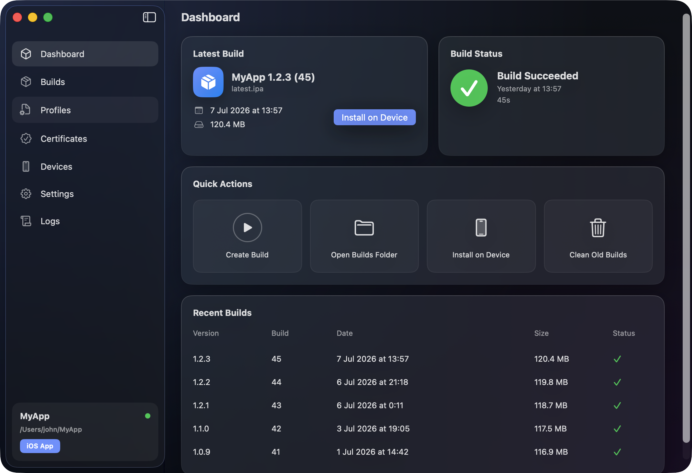
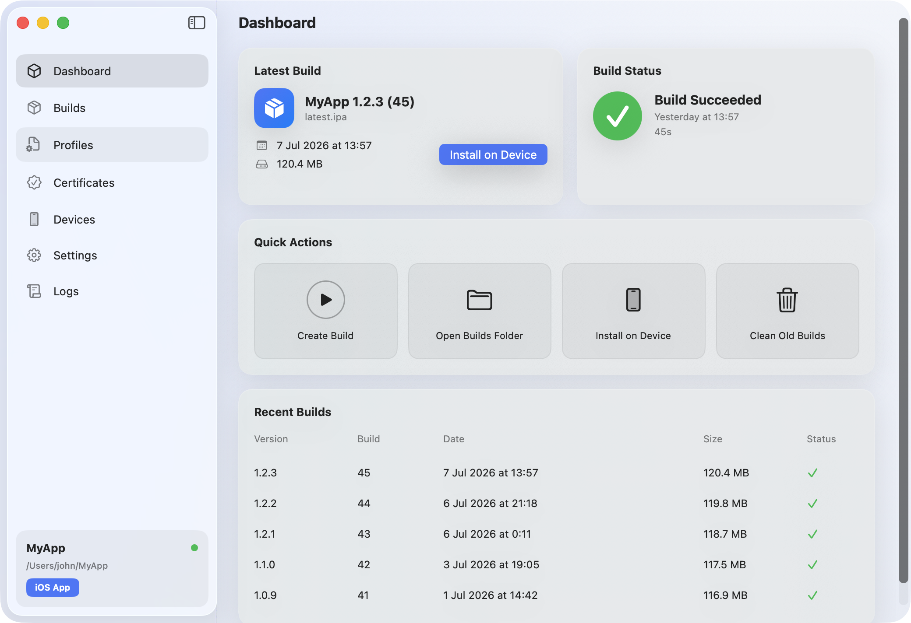

# iOS Build Manager

A native **macOS developer tool** for the free-Apple-ID sideloading workflow:
build an Xcode project, package the `.app` into an `.ipa`, and drop it into
iCloud Drive so **SideStore / AltStore / Sideloadly** can install it on your
iPhone — then keep it alive past the 7-day signing window with scheduled
rebuilds and automatic re-installs.

> Local-only. No analytics. No tracking. No network calls. MIT licensed.



<details>
<summary>Light mode</summary>



</details>

## Why

Free Apple ID signing expires every 7 days, after which sideloaded apps stop
launching. The usual fix is a manual treadmill: open Xcode, rebuild, repackage,
re-install. iOS Build Manager automates the whole loop:

**build → package IPA → upload to iCloud → re-install on device → notify you.**

No paid Apple Developer Program required. Nothing here bypasses Apple security —
the app builds and packages exactly what Xcode signs.

## Features

- **Dashboard** — latest build, live build status, quick actions, recent builds
- **One-click builds** of any `.xcodeproj` / `.xcworkspace`, with scheme
  detection (`xcodebuild -list`) and live log streaming
- **IPA packaging** — `Payload/App.app` → zip, versioned names
  (`MyApp-1.2.3-45.ipa`) plus an always-current `latest.ipa`
- **iCloud Drive output** (default `~/Library/Mobile Documents/…/iOS Builds`)
  so the IPA is reachable from your phone
- **Profiles** — scans installed provisioning profiles, shows team + expiry,
  imports `.mobileprovision` files
- **Certificates** — lists keychain signing identities with real expiry dates,
  imports `.p12` / `.cer`
- **Signing-expiry banner** — warns on the dashboard when a profile or
  certificate is about to expire, with a one-click rebuild
- **Install on device** — pushes the freshly built app to a connected iPhone
  via `devicectl`
- **Scheduled builds** — a LaunchAgent rebuilds every N days (default 6),
  re-installs on a connected device, and posts a macOS notification
- **Build notifications** — success/failure notifications for manual builds too
- **Codesign check** — verifies the app's signature before packaging and warns
  when an IPA won't be directly installable
- **Xcode Run Script helper** — package automatically after every Xcode build,
  with no build loops
- **Dark / Light / System** themes

## Requirements

- macOS 13 (Ventura) or newer
- Full **Xcode** installed (the app shells out to `xcodebuild`):

  ```bash
  sudo xcode-select -s /Applications/Xcode.app/Contents/Developer
  ```

- iCloud Drive enabled (optional — any output folder works)

## Getting started

```bash
git clone <this-repo>
cd iOSBuildManager/iOSBuildManager
xcodebuild -scheme iOSBuildManager -configuration Release build
```

Or open `iOSBuildManager/iOSBuildManager.xcodeproj` in Xcode and hit ⌘R.

First run:

1. **Settings → General → Choose…** and pick your `.xcodeproj` / `.xcworkspace`
2. Pick a **scheme** and **configuration** (Release recommended)
3. **Settings → Build** — destination `Generic iOS Device` for device IPAs
4. Hit **Create Build** on the Dashboard
5. Find the IPA in your output folder / install via SideStore, AltStore, or
   Sideloadly

## How the IPA is built

After a successful `xcodebuild` run the app:

1. Locates the built `.app` in its managed DerivedData
2. Verifies the code signature (`codesign -dvv`) and logs the authority
3. Creates `Payload/App.app` and zips it into a versioned `.ipa`
4. Refreshes `latest.ipa` in the output folder

This matches the standard sideloading IPA structure. Unsigned builds still
package (SideStore/AltStore re-sign with your Apple ID), but you'll get a clear
warning that direct device installs won't work.

## Scheduled builds

**Settings → Advanced → Scheduled Builds** installs a LaunchAgent at
`~/Library/LaunchAgents/com.rontop.iOSBuildManager.scheduler.plist` that:

1. Rebuilds your project every N days (6 by default — inside the 7-day window)
2. Repackages and refreshes `latest.ipa` in iCloud
3. Re-installs onto your iPhone if it's connected
4. Posts a notification either way

## Project structure

```
iOSBuildManager/
├── iOSBuildManager/               # Xcode project root
│   ├── iOSBuildManager/           # App sources (App/Models/Services/Theme/Views)
│   ├── iOSBuildManagerTests/      # Unit tests
│   └── iOSBuildManager.xcodeproj  # GENERATED — see below
├── scripts/
│   ├── generate_pbxproj.py        # Generates the .xcodeproj + shared scheme
│   └── package-ipa.sh             # Standalone packaging helper
├── docs/                          # Screenshots
└── .github/workflows/             # CI (build + test) and release
```

⚠️ `project.pbxproj` is **generated** — never edit it by hand. See
[CONTRIBUTING.md](CONTRIBUTING.md).

## App data

Everything lives locally in `~/Library/Application Support/iOSBuildManager/`:
`settings.json`, `projects.json`, `builds.json`, per-project `DerivedData/`,
and the packaging/scheduler helper scripts.

## Contributing

PRs welcome — please read [CONTRIBUTING.md](CONTRIBUTING.md) first (the
generated-project workflow is unusual). Run the tests with:

```bash
cd iOSBuildManager && xcodebuild -scheme iOSBuildManager test
```

## License

[MIT](LICENSE)
